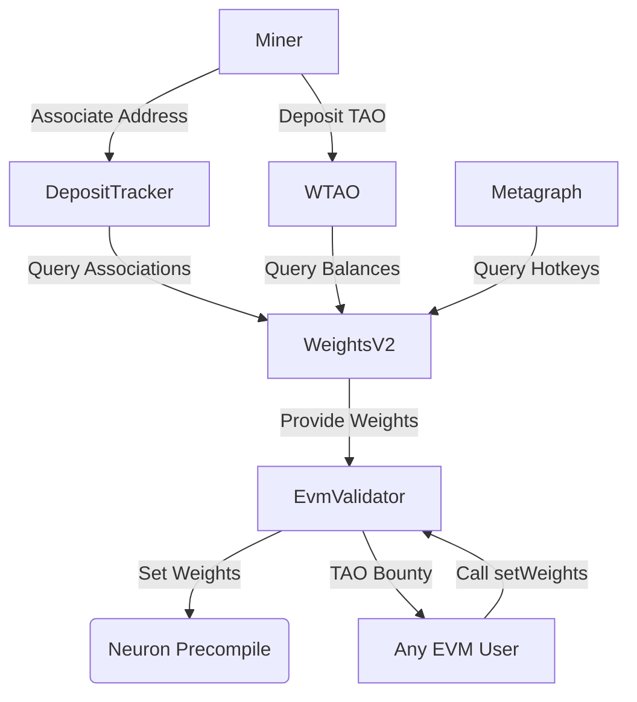
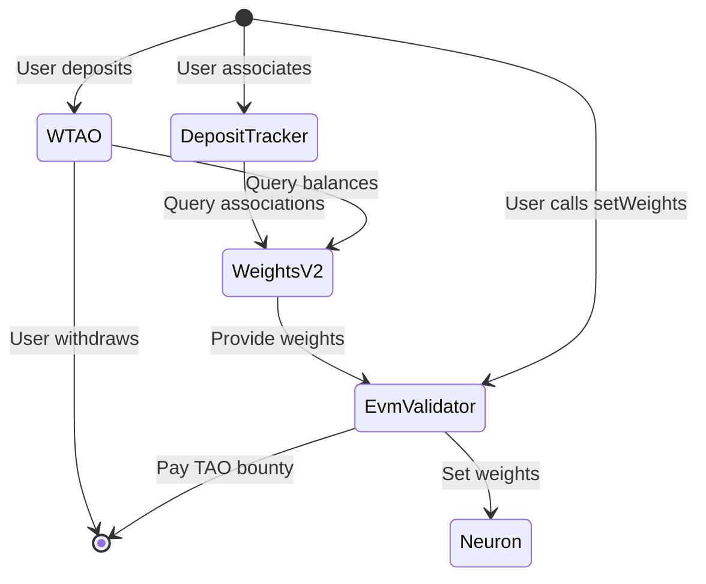

# Taonado Architecture

This document outlines the architecture of the Taonado Subnet, focusing on the separation between user funds management and weight/deposit tracking.

## System Overview

The system is designed with a clear separation of concerns between four main components:

1. **WTAO (Wrapped TAO)**: Handles user funds and token operations
2. **DepositTracker**: Manages deposit associations and tracking
3. **WeightsV2**: Calculates and normalizes weights based on deposits
4. **EvmValidator**: Manages weight setting operations and provides bounties

## Subnet Interaction Diagram



## Fund Management (WTAO)

The `WTAO` contract is responsible for:
- Managing user balances
- Handling deposits and withdrawals
- Implementing ERC20-like functionality
- Maintaining the total supply of wrapped TAO

Key features:
- Exists outside of our control, it's the standard for wTAO and used for other applications on the Bittensor EVM.
- Direct fund custody for depositers
- Standard token operations (transfer, approve, etc.)
- No ability for admins or protocol to move funds on behalf of users
- No direct interaction with weights or deposit tracking

## Deposit Tracking (DepositTracker)

The `DepositTracker` contract is responsible for:
- Associating depositor addresses with miner hotkeys
- Maintaining unique depositor records
- Tracking deposit associations
- No direct handling of funds

Key features:
- Pure tracking functionality
- No fund custody
- One-to-many relationship between hotkeys and depositors

## Weight Calculation (WeightsV2)

The `WeightsV2` contract is responsible for:
- Calculating weights based on WTAO balances
- Normalizing weights for the network
- Managing deposit goals
- No direct fund custody

Key features:
- Read-only access to WTAO balances
- Read-only access to deposit associations
- Weight normalization logic
- Burn mechanism for excess emissions
- Validators directly apply the weights, leading to high trust in their scoring.

## Weight Setting (EvmValidator)

The `EvmValidator` contract is responsible for:
- Managing weight setting operations
- Providing TAO bounties to incentivize weight setting
- Enforcing minimum intervals between weight setting calls
- Boosting miners who participate in weight setting

Key features:
- Public `setWeights` function that any EVM wallet can call
- TAO bounty system to cover gas costs
- Metagraph boost for miners who call the function
- Block interval enforcement to prevent spam
- Direct integration with Neuron precompile for weight setting
- Owner-only functions for configuration management, owner cannot influence weights

## Miner Operations

Miners participate in the protocol by:

1. **Deposit Process**
   - Deposit TAO into the WTAO contract
   - Associate their EVM address with their SS58 hotkey
   - Can withdraw TAO at any time
   - One-to-one mapping between EVM addresses and hotkeys

2. **Address Management**
   - Each miner has two key addresses:
     - SS58 hotkey (native Bittensor address)
     - EVM wallet address (for deposits)
   - Once associated, an EVM address cannot be reassigned
   - New associations require withdrawal and new deposit

3. **Earnings**
   - Earn emissions based on deposited TAO
   - Scoring logic is completely isolated from funds
   - Weights are calculated on-chain

## Validator Operations

Validators maintain the network by:

1. **Weight Setting**
   - Run a lightweight script to set weights
   - Uses EVM address as validator hotkey
   - Requires small amount of TAO on the validator HK for gas
   - Sets weights every 113 blocks

2. **Decentralized Validation**
   - The miner loop serves as a decentralized validator that:
     - Takes over the job of validation and setting weights to smart contracts
     - Can be called by any EVM wallet (not just miners)
     - Gives miners a boost if they call it themselves
     - Provides a TAO bounty to cover the cost of gas for running the validation
   - **Important**: Not every miner needs to run this validation loop
   - Validation work is distributed across the network
   - Running the validation script contributes to the network's validation process and rewards participants

3. **Process Flow**
   ```mermaid
   sequenceDiagram
       EvmValidator->>WeightsV2: Query Normalized Weights
       WeightsV2->>WTAO: Get Balances
       WeightsV2->>DepositTracker: Get Associations
       WeightsV2-->>EvmValidator: Return Normalized Weights
       EvmValidator->>Neuron: Set Weights
       EvmValidator->>User: Pay TAO Bounty
   ```

4. **Bounty Flow**
   ```mermaid
   sequenceDiagram
       participant User as Any EVM User
       participant EV as EvmValidator
       participant Neuron as Neuron Precompile
       
       User->>EV: Call setWeights()
       EV->>Neuron: Set weights to subnet
       EV->>User: Transfer TAO bounty
       Note over EV: If user is miner in metagraph,<br/>apply boost to their weights
   ```

5. **Key Features**
   - Automated weight setting
   - Direct EVM integration
   - Minimal resource requirements
   - Regular weight updates
   - Distributed validation responsibility
   - Incentivized participation through TAO bounties

## Security Considerations

1. **Fund Isolation**
   - WTAO is the only contract that holds user funds
   - Other contracts only have read access to balances
   - No direct fund transfers between tracking contracts

2. **Permission Model**
   - DepositTracker: Public association function
   - WeightsV2: Owner only deposit goal setting
   - WTAO: Standard token permissions

3. **Data Flow**
   - Funds → WTAO
   - Associations → DepositTracker
   - Weight Calculations → WeightsV2

## State Management



This architecture ensures that user funds remain secure in the WTAO contract while allowing the system to track deposits and calculate weights without direct access to the funds.
The separation of concerns extends to the miner and validator operations, maintaining security and efficiency throughout the system.
